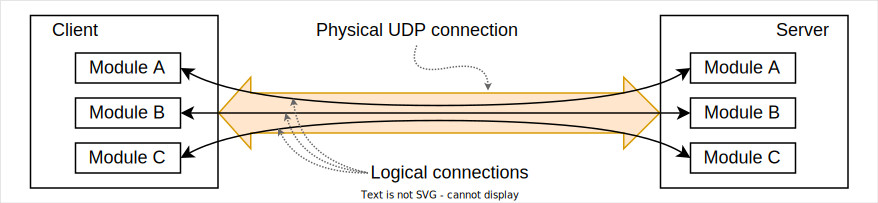

# ISessionControl
First of all, let's define what is session.  
Once player is logged in, he gets a UDP port on which to send all further requests. It forms a single UDP connection between player and server. It is also called as **physical connecton**. But since the player needs to communicate independently with a number of different modules on the server, a single physical connection should be somehow split into a number of virtual connections, one per each module:  



So, **session** is such a virtual connection. Each session has a **session_id** - a unique identifier, such that the same player can't have two sessions with the same *session_id* even in two different physical connections.

To assign a message to a particular session, corresponding *session_id* value should be send as `tunnelId` field of `Message` object. Once server receives a message, it uses a *session_id* to forward this message to the corresponding module. Once module handled a request, it sends a response with the same *session_id* so the client can know which module the response has been sent to.

A **root session** is a session, that is opened once client is logged in. If root session is closed for any reason, a physical connection is automatically closed as well. Hence, root session and physical connection have the same life time.

**ISessionControl** interface provides a way to control a particular session. All messages, declared by this interface, should be sent inside a corresponding session. Here is an interface declaration:
```protobuf
message ISessionControl {

  oneof choice {
    // Both directions
    bool heartbeat = 1;

    // Requests
    bool close = 16;
    
    // Indications
    bool closed_ind = 64;
  }
}
```

A **closed_ind** is sent by server to notify client, that this session is closed. Once this message is received, it means that client can no longer send messages in this session. If client does send a message, it will be just ignored by server.  
Note that this message can be sent by the server at any time, even if the client has not sent a `close` request. For example, it can be sent when a related module is destroyed or goes offline.

A **close** request can be sent by client to close the session. A **close_ind** message will be sent by server as a response.

A **heartbeat** is a bidirectional message. It can be sent both by server or by client. Once `heartbeat` message is received by client, it should be sent back to server immediately. If client ignores more than 3 `heartbeat` in a row, server will close the session.

Server uses **heartbeats** as a disconnection detection technique. For each physical connection server starts an inactivity timer. Every time server receives any message from the client, this timer is reset. If timer reaches 400, 800 or 1200 milliseconds, server sends a `heartbeat` message to the client. If client sends a `hearbeat` back, timer is reset to 0. But if client ignores `heartbeats` and timer reaches ~1.4 seconds, server closes the connection and all related sessions. Note that server always use *root session* to send heartbeats.
